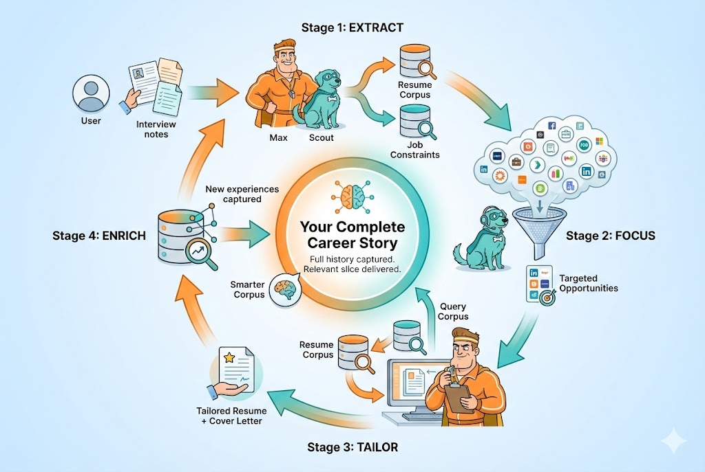
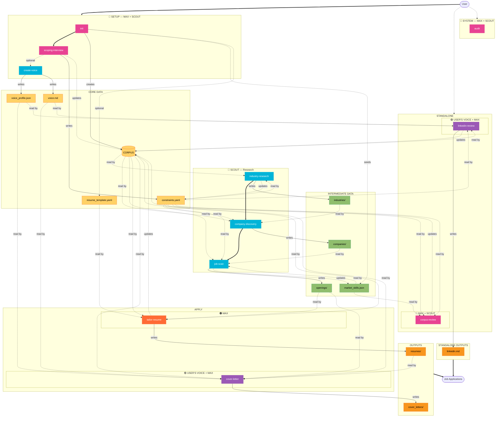

# Job Coach and Scout


A **Claude Code workflow library** for job search preparation. Three AI personas guide you through resume tailoring, cover letter generation, and market research via interview-driven conversations.

## What This Is

This is **NOT** a standalone application. It's a collection of **workflow files** that Claude Code reads and executes directly. You talk to Claude Code in natural language, and it follows the workflow instructions.

**Requirements:**
- Claude Code (Claude Pro subscription)
- Python 3 (for validation utilities)

**Optional dependencies:**
- PyYAML (`pip install pyyaml`) — for YAML validation
- WeasyPrint (`pip install weasyprint`) — for PDF resume generation

The core workflows run without any setup. Validation and PDF generation use lightweight Python utilities in `tools/`.

## How It Works



**Full history captured. Relevant slice delivered.**

The system builds a complete corpus of your career story over time — every experience, every accomplishment, every way you've described your work. When you apply to a job, it tailors that full story down to exactly what *this* hiring manager needs to see.

Each application makes the system smarter: new experiences extracted during tailoring flow back into the corpus, giving you more to draw from next time.

## The Agents

Three AI personas guide your job search. Each workflow automatically loads the appropriate persona.

| Agent | Role | Persona File |
|-------|------|--------------|
| **Max** (Job Coach) | Resume tailoring, interview prep, adversarial feedback | `agents/job-coach.md` |
| **Scout** (Job Scout) | Market research, company discovery, job scanning | `agents/job-scout.md` |
| **Voice** (Your Voice) | First-person writing in your authentic style | `agents/voice.md` (generated) |

**Max** is a veteran recruiter who challenges vague claims and pushes for specifics. **Scout** is a market intelligence analyst who finds opportunities matching your constraints. **Voice** is dynamically generated from your writing samples to write cover letters and LinkedIn content that sound authentically like you.

### Integrity Policy

**All agents will never fabricate information about you.**

- They extract and position your *real* experiences — they don't invent them
- Every new entry to your corpus is read back for your confirmation: *"Is this accurate and complete?"*
- Only confirmed entries are saved
- If something looks wrong, it's a parsing error to fix — not creative license

Your corpus is *your* story. The agents help you tell it better, not make it up.

## Quick Reference

| Command | What it does |
|---------|--------------|
| `/init` | Set up project, import resume(s), create corpus |
| `/scoping-interview` | Capture salary, location, role preferences |
| `/create-voice` | Analyze writing samples, create your Voice Agent |
| `/job-scan [company-or-url]` | Search for jobs at a company OR parse a specific posting |
| `/tailor-resume [company]` | Modify resume for specific job |
| `/cover-letter [company]` | Generate voice-matched cover letter |
| `/corpus-review` | Strategic review against market data |
| `/linkedin-review` | Optimize LinkedIn profile |
| `/industry-research` | Tier industries by fit |
| `/company-discovery [industry or company]` | Research a company or discover companies in an industry |
| `/job-coach` | Load Max for resume/interview advice |
| `/job-scout` | Load Scout for market research |
| `/audit` | Test core workflows with sample data |

## Available Skills

### Agent Personas

Load a persona for freeform conversation without running a specific workflow.

| Skill | Agent | Purpose |
|-------|-------|---------|
| `/job-coach` | Max | Resume advice, interview prep, adversarial feedback on career positioning |
| `/job-scout` | Scout | Market research, company evaluation, opportunity discovery |

### Setup & Onboarding

| Skill | Agent | Purpose |
|-------|-------|---------|
| `/init` | Both | Import resume(s), create structured corpus, set up directories |
| `/scoping-interview` | Max | 10-15 question interview about job search preferences |
| `/create-voice` | Scout | Analyze writing samples and generate your Voice Agent |

**init** creates your Resume Corpus — a structured JSON database of all your experiences, accomplishments, and skills. It also:
- Analyzes PDF resume layout to create a template for PDF generation
- Sets up `profile/writing_samples/` directory for voice analysis
- Seeds `research/market_skills.json` for market intelligence

**scoping-interview** captures your constraints: salary requirements, location preferences, role targeting, and dealbreakers. May also update corpus with discovered certifications or skills.

**create-voice** analyzes your writing samples (cover letters, emails, blog posts) across 7 dimensions to capture your authentic voice. Creates:
- `profile/voice_profile.json` — structured analysis of your writing style
- `agents/voice.md` — your personalized Voice Agent that writes like you

### Resume Preparation

| Skill | Agent | Purpose |
|-------|-------|---------|
| `/job-scan` | Scout | Search for jobs at a company OR parse a specific posting |
| `/tailor-resume` | Max | Modify existing resume for specific job |
| `/corpus-review` | Both | Strategic review of corpus against market demand |
| `/linkedin-review` | Voice + Max | Optimize LinkedIn profile for recruiters |

**job-scan** operates in two modes:

- **Search Mode** (`/job-scan Stripe`) — Searches for current openings, presents a list, lets you select which to scan
- **Direct Mode** (`/job-scan [url]`) — Parses a specific job posting you provide

Both modes then:
- Extract MUST-HAVE and NICE-TO-HAVE requirements
- Calculate fit score against your corpus and constraints
- Update `market_skills.json` with skill demand data
- Update company profiles with tracked openings (if profiled)
- Support re-validation to detect posting changes

**tailor-resume** requires a starting resume to modify (not generate from scratch). It applies corpus content, conducts gap-closing interviews, and outputs both Markdown and PDF. Updates corpus with newly discovered accomplishments.

**corpus-review** uses market intelligence from all your job scans to identify strategic gaps:
- Scout analyzes your accomplishments against `research/market_skills.json`
- Max probes for experiences to close high-demand skill gaps
- Updates corpus with strengthened and new accomplishments

**linkedin-review** crafts a compelling profile with keyword-rich headline, narrative About section, and optimized skills for search visibility. Voice Agent writes the About section and experience narratives in your authentic style; Max handles headline strategy and skills optimization. Updates corpus with new narrative content.

### Application Materials

| Skill | Agent | Purpose |
|-------|-------|---------|
| `/cover-letter` | Voice + Max | Voice-matched cover letter with optional positioning review |

**cover-letter** uses your Voice Agent to write cover letters that sound authentically like you. The workflow:
- Loads your Voice Agent (or creates one from writing samples if needed)
- Writes the first draft in your authentic voice
- Optionally has Max review positioning from a hiring manager's perspective
- Iterates based on your feedback

### Research & Discovery

| Skill | Agent | Purpose |
|-------|-------|---------|
| `/industry-research` | Scout | Tier industries by fit with your profile |
| `/company-discovery` | Scout | Research a specific company or discover companies in an industry |

**industry-research** analyzes where your skills are most valued and hiring trends are strongest. Produces Tier 1/2/3 rankings and creates company stubs for handoff to company-discovery.

**company-discovery** operates in two modes based on your input:

- **Enrichment Mode** (`/company-discovery Stripe`) — Deep-dive research on a specific company
- **Discovery Mode** (`/company-discovery fintech`) — Find and rank companies in an industry

Both modes create detailed company profiles with:
- Fit scoring against your constraints
- Hiring signals (funding, growth, leadership changes)
- Tech stack and remote policy research
- **Tracked Openings section** that auto-populates when you `/job-scan` postings from that company
- Optimized job search queries for LinkedIn and other platforms

### System & Maintenance

| Skill | Agent | Purpose |
|-------|-------|---------|
| `/audit` | Both | Verify core workflows function correctly |

**audit** tests the `init` → `job-scan` → `tailor-resume` pipeline with sample data. Creates temporary files that are cleaned up afterward.

## Agent Personas

### Max — Job Coach

A veteran recruiter with 15+ years experience. Adversarial by default, Max challenges vague claims, probes for forgotten experiences, and ensures every resume bullet can survive "tell me more about that."

**Communication style:** Direct, skeptical, no sugarcoating. Configurable via scoping-interview:
- **Brutally honest** (default): Maximum challenge, minimum hand-holding
- **Balanced**: Challenge with encouragement
- **Supportive**: Gentler delivery, same standards

**Core principles:**
1. Never fabricate — your story must be true
2. Brutal honesty over polite encouragement
3. Every bullet must survive "tell me more about that"
4. Story-backed claims only — vague is weak
5. Quantify or cut
6. Position, don't just describe

### Scout — Job Scout

A strategic market intelligence analyst. Scout tracks hiring trends, evaluates companies, and surfaces opportunities that match your constraints.

**Communication style:** Analytical, methodical, data-driven. Leads with findings, follows with reasoning.

**Core principles:**
1. Never fabricate — your story must be true
2. Quality over quantity in company targeting
3. Track hiring signals, not just job postings
4. Fit assessment against your constraints
5. Industry trends inform strategy
6. Research compounds

### Voice — Your Authentic Voice

A dynamically generated persona that embodies *your* writing style. Created by analyzing your writing samples, Voice writes first-person content that's indistinguishable from your own words.

**Communication style:** Mirrors your natural voice — your tone, your sentence structure, your vocabulary, your signature phrases.

**How it works:**
1. Run `/create-voice` with writing samples in `profile/writing_samples/`
2. Scout analyzes your writing across 7 dimensions (tone, structure, vocabulary, etc.)
3. Creates `agents/voice.md` — your personalized Voice Agent
4. Cover letters and LinkedIn narratives now sound like *you* wrote them

**Why a separate agent?** Max's adversarial tone shouldn't leak into your cover letters. Voice solves the "personality bleed" problem by keeping first-person writing separate from coaching and feedback.

## System Overview



| Element | Meaning |
|---------|---------|
| 🟠 Orange | MAX workflows (Resume Tailoring & Feedback) |
| 🔵 Teal | SCOUT workflows (Market Research & Discovery) |
| 🔴 Pink | MAX + SCOUT workflows (Dual-agent collaboration) |
| 🟣 Purple | USER'S VOICE workflows (Authentic Writing Style) |
| 🟡 Yellow | Core Data — foundational profile (corpus, constraints, voice, template) |
| 🟢 Green | Intermediate Data — research artifacts (industries, companies, openings) |
| 🟧 Orange | Outputs — final deliverables (resumes, cover letters, LinkedIn) |
| **Thick arrows** | Workflow handoffs (sequence between workflows) |
| Solid arrows | Data writes (workflow creates/updates data) |
| Dashed arrows | Data reads or optional/conditional flows |

The diagram shows how workflows interact with your **Resume Corpus** (the central knowledge base) and **constraints.yaml** (your job search preferences):

- **Setup Phase:** `init` imports your resumes and creates the corpus; `scoping-interview` captures your constraints; `create-voice` analyzes your writing samples
- **Research Phase:** `industry-research` → `company-discovery` → `job-scan` to find opportunities
- **Apply Phase:** `tailor-resume` → `cover-letter` → application ready

**Agent colors:** Max (orange) handles resume tailoring and feedback. Scout (teal) handles market research and discovery. Voice (purple) writes in your authentic style. The corpus grows smarter with each tailoring session as new accomplishments and variations are captured.

## Directory Structure

```
job-coach-and-scout/
├── README.md                    # This file
├── .gitignore                   # Git ignore patterns
│
├── agents/                      # Agent persona definitions
│   ├── job-coach.md             # Max's persona, principles, behaviors
│   ├── job-scout.md             # Scout's persona, principles, behaviors
│   ├── voice-template.md        # Template for generating Voice Agent
│   └── voice.md                 # Your Voice Agent (generated by /create-voice)
│
├── workflows/                   # Workflow definitions (executed by skills)
│   ├── init/                    # Project initialization
│   ├── scoping-interview/       # Preference capture
│   ├── create-voice/            # Voice Agent creation
│   ├── job-scan/                # Job posting analysis
│   ├── tailor-resume/           # Resume tailoring
│   ├── cover-letter/            # Cover letter generation
│   ├── corpus-review/           # Strategic corpus review
│   ├── linkedin-review/         # LinkedIn optimization
│   ├── industry-research/       # Industry analysis
│   ├── company-discovery/       # Company targeting
│   └── audit/                   # System diagnostics
│
├── tools/                       # Utility scripts
│   ├── check-pdf-tools.sh       # PDF tool detection
│   ├── generate-pdf.py          # PDF resume generation
│   ├── templates/               # PDF templates (Typst)
│   ├── validate-json.sh         # JSON validation
│   └── validate-yaml.sh         # YAML validation
│
├── profile/                     # Your data (created by init)
│   ├── corpus.json              # Your structured Resume Corpus
│   ├── voice_profile.json       # Your writing voice characteristics
│   ├── resume_template.yaml     # PDF styling template
│   ├── constraints.yaml         # Job search constraints
│   ├── linkedin.md              # Optimized LinkedIn profile
│   ├── imports/                 # Drop zone for source resumes
│   └── writing_samples/         # Voice analysis samples
│
├── applications/                # Generated outputs
│   ├── resumes/                 # Tailored resumes (Markdown + PDF)
│   └── cover_letters/           # Generated cover letters
│
└── research/                    # Market intelligence
    ├── industries/              # Industry analysis
    │   ├── index.md             # Tiered summary of all industries
    │   └── {industry}.md        # Individual industry analyses
    ├── market_skills.json       # Aggregated skill demand data
    ├── openings/                # Parsed job postings
    └── companies/               # Company profiles by industry
        └── {industry}/
            ├── index.md         # Industry company rankings
            └── {company}.md     # Individual company profiles
```

## Market Intelligence System

The system builds market intelligence over time as you analyze job postings and research companies.

### Market Skills Database

Every time you run `/job-scan`, the workflow extracts technical skills and (with your confirmation) adds them to `research/market_skills.json`:

```json
{
  "Python": { "count": 15, "must_have_count": 10, "nice_to_have_count": 5 },
  "Kubernetes": { "count": 8, "must_have_count": 8, "nice_to_have_count": 0 },
  "Go": { "count": 7, "must_have_count": 5, "nice_to_have_count": 2 }
}
```

**How it's used:**
- `/corpus-review` analyzes your accomplishments against this data to identify strategic gaps
- High-demand skills you lack evidence for become priority targets for gap-closing interviews
- The more jobs you scan, the more accurate your market picture becomes

### Tracked Openings Per Company

When you run `/company-discovery`, each company profile includes a **Tracked Openings** section:

```markdown
## Tracked Openings
| Role | Fit Score | Date Scanned | Analysis |
|------|-----------|--------------|----------|
| Staff Engineer | 78% | 2026-01-15 | [View](../../openings/stripe-staff-engineer.md) |
| Platform Lead | 65% | 2026-01-20 | [View](../../openings/stripe-platform-lead.md) |
```

**Cross-workflow integration:**
1. `/company-discovery` creates company profiles in `research/companies/{industry}/`
2. `/job-scan` automatically finds matching company profiles
3. Each scanned job is added to that company's Tracked Openings table
4. You get a per-company view of all opportunities you've analyzed

### Duplicate Detection & Re-validation

`/job-scan` intelligently detects when you're scanning a previously analyzed posting:

1. **Exact URL match** - finds the existing analysis immediately
2. **Fuzzy matching** - detects same company + similar role (handles "Sr." vs "Senior", etc.)
3. **Re-validation flow** - compares new posting against stored requirements:
   - Added requirements
   - Removed requirements
   - Priority changes (NICE-TO-HAVE → MUST-HAVE)
   - Wording updates ("3+ years" → "5+ years")

This prevents duplicate files and lets you track how postings evolve over time.

### Data Flow

```
/job-scan ─────┬──→ research/openings/{company}-{role}.md
               │
               ├──→ research/market_skills.json (skill counts updated)
               │
               └──→ research/companies/{industry}/{company}.md
                    (Tracked Openings section updated)

/corpus-review ←── research/market_skills.json
               │
               └──→ profile/corpus.json (strategic gaps closed)
```

## Data Model

This project uses **flat JSON/YAML files** rather than a database. This is intentional:

| File | Purpose | Format |
|------|---------|--------|
| `profile/corpus.json` | All your experiences, accomplishments, skills | JSON |
| `profile/voice_profile.json` | Your writing voice characteristics | JSON |
| `agents/voice.md` | Your personalized Voice Agent | Markdown |
| `profile/resume_template.yaml` | PDF styling from your original resume | YAML |
| `profile/constraints.yaml` | Job search preferences and dealbreakers | YAML |
| `research/market_skills.json` | Aggregated skill demand from job scans | JSON |

**Why flat files?**
- AI-native: Claude reads/writes directly without database drivers
- Human-readable: Inspect and edit any file manually
- Git-friendly: All changes are diffable and version-controllable
- Zero dependencies: No database to install or maintain
- Portable: Copy the folder, everything moves with it

## Getting Started

1. **Initialize your project:**
   ```
   /init
   ```
   Or say: "Help me set up my job search project"

   The init workflow will:
   - Introduce you to Max and Scout
   - Ask for privacy agreement before processing personal data
   - Parse your resume(s) into the structured Resume Corpus
   - Analyze PDF layout for resume template (if PDF provided)

2. **Complete the scoping interview:**
   ```
   /scoping-interview
   ```
   This captures salary, location, role preferences, and dealbreakers.

3. **Create your Voice Agent (optional but recommended):**
   ```
   /create-voice
   ```
   Add writing samples (cover letters, emails, blog posts) to `profile/writing_samples/`, then run this workflow. Your Voice Agent will write cover letters and LinkedIn content that sound like you.

4. **Start applying:**
   - Scan a job posting: `/job-scan [url]`
   - Tailor your resume: `/tailor-resume [company]`
   - Generate a cover letter: `/cover-letter [company]`

5. **Or research first:**
   - Analyze industries: `/industry-research`
   - Discover companies: `/company-discovery [industry]`
   - Then scan postings from target companies

## Privacy

**Before you begin:** The init workflow requires your explicit agreement to continue. You'll be informed that:

- Personal data (resume, salary expectations, career history) will be processed by frontier LLMs
- All data is stored locally in this project directory (unencrypted)
- You are responsible for securing your machine
- No telemetry, analytics, or external calls from this project
- Data processed in Claude Code sessions is subject to Anthropic's data handling policies

## Fit Score Thresholds

The **job-scan** and **tailor-resume** workflows use evidence-based thresholds:

| Score | Verdict | Recommendation |
|-------|---------|----------------|
| **80-100%** | Excellent Fit | PROCEED — 2-3x higher interview callback rate |
| **70-79%** | Good Fit | PROCEED — Reliably passes ATS screening |
| **60-69%** | Moderate Fit | PROCEED WITH CAUTION — Minimum competitive threshold |
| **50-59%** | Weak Fit | STRETCH — Possible but requires extra effort |
| **Below 50%** | Poor Fit | RECONSIDER — ~90% rejection rate |

**MUST-HAVE gap adjustments:** Missing 2+ critical requirements drops recommendations regardless of overall score.

### Research Sources

- **80%+ threshold**: Candidates with 80%+ match receive 2-3x more interview callbacks ([Jobscan](https://www.jobscan.co/blog/what-jobscan-match-rate-should-i-aim-for/))
- **70%+ threshold**: Resumes at 70%+ reliably bypass ATS filters ([Parkes Career Services](https://www.parkescareerservices.com/post/decoding-ats-what-percentage-must-your-resume-match-to-get-noticed))
- **60% threshold**: 60% qualified with a referral often beats 100% qualified with none ([InHerSight](https://www.inhersight.com/blog/insight-commentary/why-60-percent-qualified-is-enough))
- **50% threshold**: TalentWorks found 50% match gets interviews nearly as often as 90%+ ([CNBC](https://www.cnbc.com/2018/12/12/matching-half-of-a-jobs-requirements-might-still-get-you-an-interview.html))
- **Below 50%**: Sub-60% match rates see ~90% human reviewer rejection ([Jobscan](https://www.jobscan.co/blog/what-jobscan-match-rate-should-i-aim-for/))

## Workflow Reference

Detailed read/write specifications for each workflow.

### `/init`

| Reads | Writes |
|-------|--------|
| User-provided resume(s) | `profile/corpus.json` |
| | `profile/resume_template.yaml` (if PDF imported) |
| | `profile/imports/` (directory) |
| | `profile/writing_samples/` (directory) |
| | `applications/resumes/` (directory) |
| | `applications/cover_letters/` (directory) |
| | `research/companies/` (directory) |
| | `research/openings/` (directory) |
| | `research/market_skills.json` (empty seed) |

### `/scoping-interview`

| Reads | Writes |
|-------|--------|
| `profile/corpus.json` (recommended) | `profile/constraints.yaml` |
| | `profile/corpus.json` (updated, if new info discovered) |

### `/create-voice`

| Reads | Writes |
|-------|--------|
| `profile/writing_samples/*` | `profile/voice_profile.json` |
| `profile/constraints.yaml` (for user name) | `agents/voice.md` |
| `agents/voice-template.md` | |

### `/job-scan`

| Reads | Writes |
|-------|--------|
| Company name OR job posting (URL, file, pasted) | `research/openings/{company}-{role}.md` |
| `profile/corpus.json` | `research/market_skills.json` (updated) |
| `profile/constraints.yaml` | `research/companies/{industry}/{company}.md` (Tracked Openings updated) |
| `research/market_skills.json` | |
| `research/openings/*.md` (duplicate detection) | |
| `research/companies/{industry}/{company}.md` | |

**Search Mode:** When given a company name, searches job boards for current openings and presents a selectable list before scanning.

### `/tailor-resume`

| Reads | Writes |
|-------|--------|
| Starting resume (required) | `applications/resumes/{company}-{role}.md` |
| `profile/corpus.json` | `applications/resumes/{company}-{role}.pdf` (if PDF tools installed) |
| `research/openings/{company}-{role}.md` | `profile/corpus.json` (updated with new accomplishments) |
| `profile/constraints.yaml` (optional) | |
| `profile/resume_template.yaml` (for PDF styling) | |

### `/cover-letter`

| Reads | Writes |
|-------|--------|
| `agents/voice.md` (preferred) | `applications/cover_letters/{company}-{role}.md` |
| `profile/voice_profile.json` (fallback) | `agents/voice.md` (generated if missing) |
| `profile/writing_samples/*` (last resort) | `profile/voice_profile.json` (created if missing) |
| `profile/corpus.json` | |
| `research/openings/{company}-{role}.md` | |
| `profile/constraints.yaml` | |
| `applications/resumes/{company}-{role}.md` (recommended) | |

**Fallback chain:** Voice Agent → voice_profile.json → writing samples → proceed without voice matching

### `/corpus-review`

| Reads | Writes |
|-------|--------|
| `profile/corpus.json` | `profile/corpus.json` (updated) |
| `research/market_skills.json` | `profile/corpus.json.bak` (backup) |
| `profile/constraints.yaml` (optional) | |

### `/linkedin-review`

| Reads | Writes |
|-------|--------|
| `profile/corpus.json` | `profile/linkedin.md` |
| `agents/voice.md` (for About/narratives) | `profile/corpus.json` (updated with narrative content) |
| `profile/voice_profile.json` (fallback) | |
| `profile/constraints.yaml` (optional) | |
| `profile/linkedin.md` (if exists) | |

**Agent roles:** Voice Agent writes About section and experience narratives; Max handles headline, skills, and positioning review.

### `/industry-research`

| Reads | Writes |
|-------|--------|
| `profile/corpus.json` | `research/industries/index.md` |
| `profile/constraints.yaml` | `research/industries/{industry}.md` (per industry) |
| `research/industries/index.md` (if exists) | `research/companies/{industry}/{company}.md` (stubs) |

### `/company-discovery`

| Reads | Writes |
|-------|--------|
| `profile/corpus.json` | `research/companies/{industry}/index.md` |
| `profile/constraints.yaml` | `research/companies/{industry}/{company}.md` |
| `research/industries/index.md` | |
| `research/companies/{industry}/` (existing stubs) | |

### `/audit`

| Reads | Writes |
|-------|--------|
| `workflows/audit/sample_data/sample_resume.md` | `profile/audit_corpus.json` (temporary) |
| `workflows/audit/sample_data/sample_job_description.txt` | `research/openings/audit-*.md` (temporary) |
| | (All temporary files cleaned up at end) |
