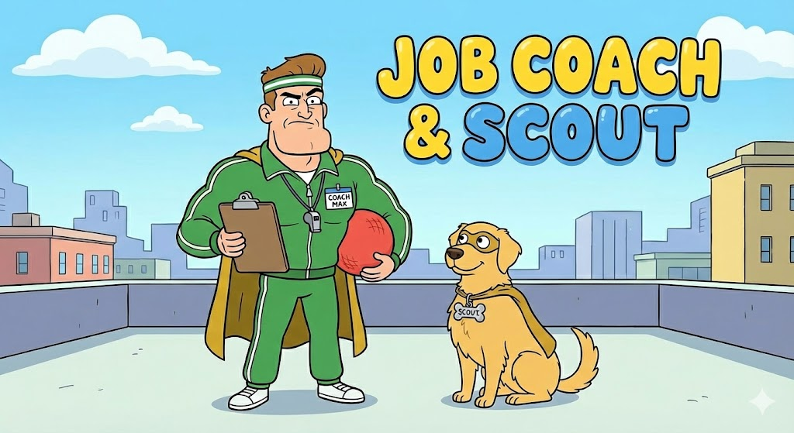
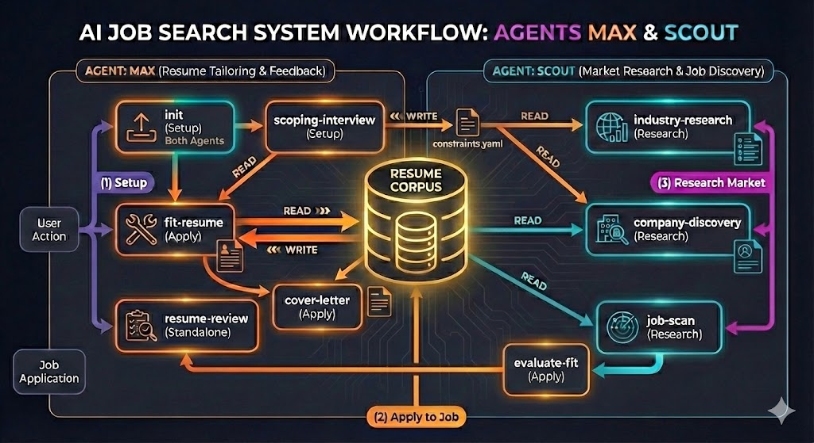

# Job Coach and Scout



A **Claude Code workflow library** for job search preparation. Two AI personas guide you through resume tailoring, cover letter generation, and market research via interview-driven conversations.

## What This Is

This is **NOT** a standalone application. There is no CLI, no Python code, no installation required.

This is a collection of **workflow files** that Claude Code reads and executes directly. You talk to Claude Code in natural language, and it follows the workflow instructions.

**Requirements:**
- Claude Code (Claude Pro subscription)
- That's it. No dependencies, no API keys, no installation.

## How to Use

1. Open this project directory in Claude Code
2. Ask Claude Code to run a workflow using natural language

**Example invocations:**

| What you say | What happens |
|--------------|--------------|
| "Help me get started" | Runs the init workflow |
| "Run the scoping interview" | Captures your job search constraints |
| "Scan this job posting" | Parses and evaluates a job posting |
| "Tailor my resume for this job" | Interview-driven resume tailoring |
| "Review my resume" | Adversarial feedback on your master resume |
| "Write a cover letter" | Voice-matched cover letter generation |
| "Research fintech companies" | Market intelligence and company discovery |

## Available Workflows

### Setup & Onboarding

| Workflow | Purpose | Inputs | Outputs |
|----------|---------|--------|---------|
| **init** | Parse resumes into structured corpus | Your resume(s) — file, URL, or pasted | `profile/corpus.json` |
| **scoping-interview** | Capture job search preferences | Conversational Q&A | `profile/constraints.yaml` |

### Resume Preparation

| Workflow | Purpose | Inputs | Outputs |
|----------|---------|--------|---------|
| **job-scan** | Parse job posting into requirements | Job posting (URL, file, or pasted) | `research/openings/{company}-{role}.md` |
| **evaluate-fit** | Score alignment with job requirements | `corpus.json` + job posting | Display only (no file) |
| **tailor-resume** | Tailor resume for specific job | `corpus.json` + job posting | `applications/resumes/{company}-{role}.md` |
| **resume-review** | Adversarial review of corpus | `corpus.json` | Updated `corpus.json` |

### Application Materials

| Workflow | Purpose | Inputs | Outputs |
|----------|---------|--------|---------|
| **cover-letter** | Voice-matched cover letter | `corpus.json` + tailored resume + writing samples | `applications/cover_letters/{company}-{role}.md` |

### Research & Discovery

| Workflow | Purpose | Inputs | Outputs |
|----------|---------|--------|---------|
| **industry-research** | Analyze industries by fit | `corpus.json` + `constraints.yaml` | `research/industries.md` |
| **company-discovery** | Find and rank target companies | `corpus.json` + `constraints.yaml` + industry | `research/companies/{industry}/*.md` |

### System & Maintenance

| Workflow | Purpose | Inputs | Outputs |
|----------|---------|--------|---------|
| **audit** | Verify core workflows function correctly | None | Audit report (display only) |

## Agent Personas

### Max — Job Coach

A veteran recruiter with 15+ years experience. Adversarial by default, Max challenges vague claims, probes for forgotten experiences, and ensures every resume bullet can survive "tell me more about that."

### Scout — Job Scout

A strategic market intelligence analyst. Scout tracks hiring trends, evaluates companies, and surfaces opportunities that match your constraints.

## System Overview



The diagram above shows how workflows interact with your **Resume Corpus** (the central knowledge base) and **constraints.yaml** (your job search preferences):

- **Setup Flow (1):** `init` imports your resumes and creates the corpus; `scoping-interview` captures your constraints
- **Apply to Job Flow (2):** `job-scan` → `evaluate-fit` → `tailor-resume` → `cover-letter` → application ready
- **Research Flow (3):** `industry-research` → `company-discovery` → `job-scan` to find opportunities

Max (orange) handles resume tailoring and feedback. Scout (teal) handles market research and job discovery. The corpus grows smarter with each tailoring session as new accomplishments and variations are captured.

## Directory Structure

```
job-coach-and-scout/
├── README.md                    # This file
├── .gitignore                   # Git ignore patterns
├── agents/                      # Agent persona definitions
│   ├── job-coach.md
│   └── job-scout.md
│
├── tools/                       # Utility scripts for validation
│   ├── validate-json.sh        # Deterministic JSON validator
│   └── validate-yaml.sh        # Deterministic YAML validator
│
├── workflows/                   # Workflow definitions
│   ├── init/                   # Project initialization
│   ├── ...                     # Other workflows
│
├── profile/                     # Your data (created by init)
│   ├── corpus.json             # Your structured Resume Corpus
│   ├── constraints.yaml        # Job search constraints
│   └── writing_samples/        # Voice analysis samples
│
├── applications/                # Generated outputs
│   ├── resumes/                # Tailored resumes (in Markdown)
│   └── cover_letters/          # Generated cover letters
│
└── research/                    # Market intelligence
    ├── ...                     # Research files
```

## Getting Started

1. **Initialize your project:**
   Ask Claude Code: "Help me set up my job search project"

   The init workflow will:
   - Introduce you to your agents, Max and Scout.
   - Ask for your agreement before processing personal data.
   - Parse your resume (from text or a file) into a structured **Resume Corpus** (`profile/corpus.json`). This becomes the central, queryable knowledge base of your entire career history.
   - Set up the rest of the project directory structure.

2. **Complete the scoping interview:**
   Ask Claude Code: "Run the scoping interview"

3. **Start applying:**
   - Provide a job posting and ask Claude Code to **tailor your resume**. The `tailor-resume` workflow will now query your corpus to assemble the best possible resume.
   - Or ask for a **corpus review** to strengthen your data.

## Privacy

**Before you begin:** The init workflow requires your explicit agreement to continue. You'll be informed that:

- Personal data (resume, salary expectations, career history) will be processed by frontier LLMs
- All data is stored locally in this project directory (unencrypted)
- You are responsible for securing your machine
- No telemetry, analytics, or external calls from this project
- Data processed in Claude Code sessions is subject to Anthropic's data handling policies

## Alignment Score Thresholds

The **evaluate-fit** and **tailor-resume** workflows use evidence-based thresholds derived from recruiting industry research:

| Score | Verdict | Recommendation |
|-------|---------|----------------|
| **80-100%** | Excellent Fit | PROCEED — 2-3x higher interview callback rate |
| **70-79%** | Good Fit | PROCEED — Reliably passes ATS screening |
| **60-69%** | Moderate Fit | PROCEED WITH CAUTION — Minimum competitive threshold |
| **50-59%** | Weak Fit | STRETCH — Possible but requires extra effort |
| **Below 50%** | Poor Fit | RECONSIDER — ~90% rejection rate |

**MUST-HAVE gap adjustments:** Missing 2+ critical requirements drops recommendations regardless of overall score.

### Research Sources

- **80%+ threshold**: Candidates with 80%+ match receive 2-3x more interview callbacks ([Jobscan](https://www.jobscan.co/blog/what-jobscan-match-rate-should-i-aim-for/), [ERE](https://www.ere.net/articles/why-good-candidates-fail-beware-the-90-percent-job-fit))
- **70%+ threshold**: Resumes at 70%+ reliably bypass ATS filters ([Parkes Career Services](https://www.parkescareerservices.com/post/decoding-ats-what-percentage-must-your-resume-match-to-get-noticed))
- **60% threshold**: 60% qualified with a referral often beats 100% qualified with none ([InHerSight](https://www.inhersight.com/blog/insight-commentary/why-60-percent-qualified-is-enough))
- **50% threshold**: TalentWorks found 50% match gets interviews nearly as often as 90%+ ([CNBC](https://www.cnbc.com/2018/12/12/matching-half-of-a-jobs-requirements-might-still-get-you-an-interview.html))
- **Below 50%**: Sub-60% match rates see ~90% human reviewer rejection ([Jobscan](https://www.jobscan.co/blog/what-jobscan-match-rate-should-i-aim-for/))

## File Formats

| Data | Format | Location |
|------|--------|----------|
| Resume Corpus | JSON | `profile/corpus.json` |
| Constraints | YAML | `profile/constraints.yaml` |
| Tailored resumes | Markdown | `applications/resumes/{company}-{role}.md` |
| Cover letters | Markdown | `applications/cover_letters/{company}-{role}.md` |
| Research | Markdown | `research/` subdirectories |
