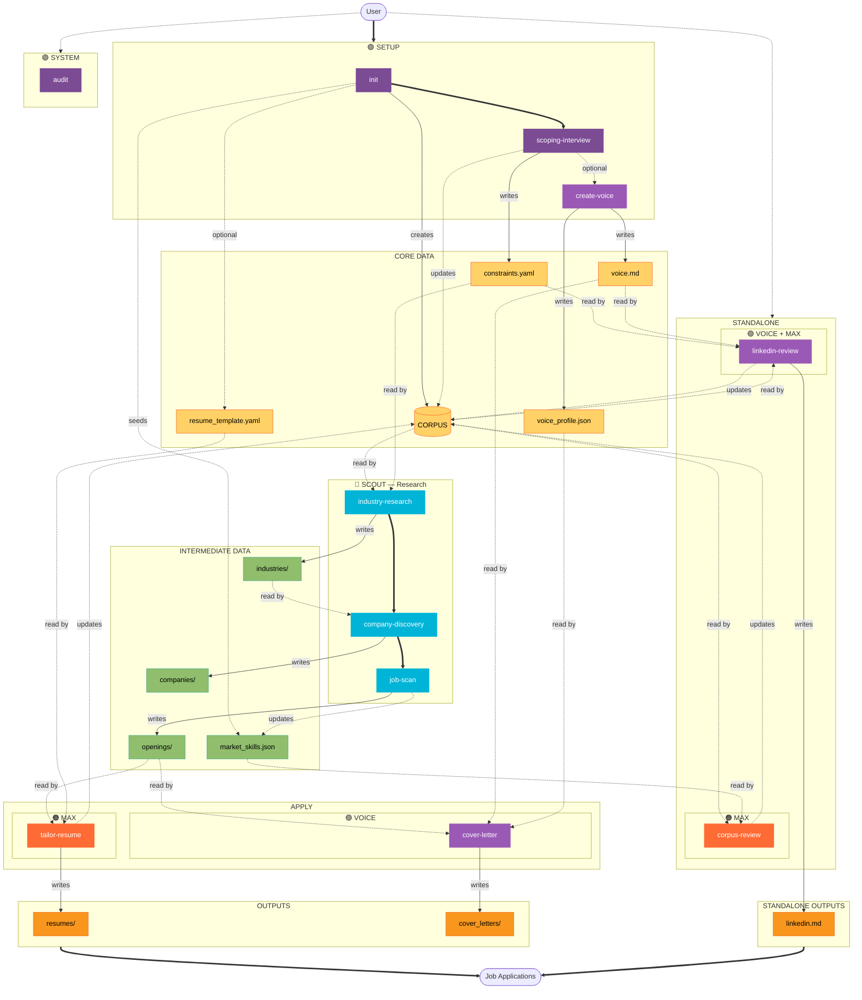

# System Architecture Diagram

> **IMPORTANT:** This file is the authoritative source for the system diagram. After ANY changes:
> 1. Run `python3 tools/validate-diagram.py` to validate against workflow/agent files
> 2. Copy the mermaid block to README.md (validation will fail if they differ)

## Schema

<!--
  Machine-parseable tables defining the diagram structure.
  Validation script cross-references these against workflow Summary blocks.
  Run: python3 tools/validate-diagram.py
-->

### Agents

| id | style | color | label | source |
|----|-------|-------|-------|--------|
| max | maxStyle | #ff6b35 | AGENT MAX — Resume Tailoring & Feedback | agents/job-coach.md |
| scout | scoutStyle | #00b4d8 | AGENT SCOUT — Market Research & Discovery | agents/job-scout.md |
| voice | voiceStyle | #9b59b6 | VOICE — Authentic Writing Style | agents/voice.md |
| dual | dualStyle | #7b4b94 | Both Agents | — |

### Data Stores

| id | type | path | label |
|----|------|------|-------|
| corpus | central | profile/corpus.json | RESUME CORPUS |
| constraints | file | profile/constraints.yaml | constraints.yaml |
| voice_profile | file | profile/voice_profile.json | voice_profile.json |
| voice_agent | file | agents/voice.md | voice.md |
| resume_template | file | profile/resume_template.yaml | resume_template.yaml |
| linkedinmd | file | profile/linkedin.md | linkedin.md |
| market_skills | file | research/market_skills.json | market_skills.json |
| industries | directory | research/industries/ | industries/ |
| companies | directory | research/companies/ | companies/ |
| openings | directory | research/openings/ | openings/ |
| resumes | directory | applications/resumes/ | resumes/ |
| coverletters | directory | applications/cover_letters/ | cover_letters/ |

### Workflows

| id | phase | agents | lead | source |
|----|-------|--------|------|--------|
| init | setup | max, scout | max | workflows/init/workflow.md |
| scoping | setup | max, scout | max | workflows/scoping-interview/workflow.md |
| create_voice | setup | scout | — | workflows/create-voice/workflow.md |
| industry | research | scout | — | workflows/industry-research/workflow.md |
| company | research | scout | — | workflows/company-discovery/workflow.md |
| jobscan | research | scout | — | workflows/job-scan/workflow.md |
| tailor | apply | max | — | workflows/tailor-resume/workflow.md |
| cover | apply | voice, max | voice | workflows/cover-letter/workflow.md |
| corpus_rev | standalone | max, scout | max | workflows/corpus-review/workflow.md |
| linkedin | standalone | voice, max | voice | workflows/linkedin-review/workflow.md |
| audit | system | max, scout | — | workflows/audit/workflow.md |

### Data Flows

<!-- Legend: ? = optional/conditional, — = none -->

| workflow | reads | writes | updates |
|----------|-------|--------|---------|
| init | — | corpus, market_skills, resume_template? | — |
| scoping | corpus | constraints | corpus? |
| create_voice | writing_samples | voice_profile, voice_agent | — |
| industry | corpus, constraints, industries? | industries, companies | constraints? |
| company | corpus, constraints, industries, companies? | companies | — |
| jobscan | corpus, constraints, market_skills, openings?, companies? | openings | market_skills, companies? |
| tailor | corpus, constraints?, openings, resume_template?, resumes? | resumes | corpus |
| cover | corpus, constraints, voice_agent?, voice_profile?, openings, resumes? | coverletters | voice_profile?, voice_agent? |
| corpus_rev | corpus, market_skills, constraints? | — | corpus |
| linkedin | corpus, constraints?, voice_agent?, voice_profile?, linkedinmd? | linkedinmd | corpus |
| audit | — | — | — |

---

## Diagram

---

## Legend

| Element | Meaning |
|---------|---------|
| 🟠 Orange | MAX workflows (Resume Tailoring & Feedback) |
| 🔵 Teal | SCOUT workflows (Market Research & Discovery) |
| 🟣 Purple | VOICE workflows (Authentic Writing Style) or SETUP (Dual-agent) |
| 🟡 Yellow | Core Data — foundational profile (corpus, constraints, voice, template) |
| 🟢 Green | Intermediate Data — research artifacts (industries, companies, openings) |
| 🟧 Orange | Outputs — final deliverables (resumes, cover letters, LinkedIn) |
| **Thick arrows** | Workflow handoffs (sequence between workflows) |
| Solid arrows | Data writes (workflow creates/updates data) |
| Dashed arrows | Data reads or optional/conditional flows |

## Rendering

This diagram renders in:
- GitHub (native Mermaid support)
- VS Code (with Mermaid extension)
- Obsidian
- [Mermaid Live Editor](https://mermaid.live)
